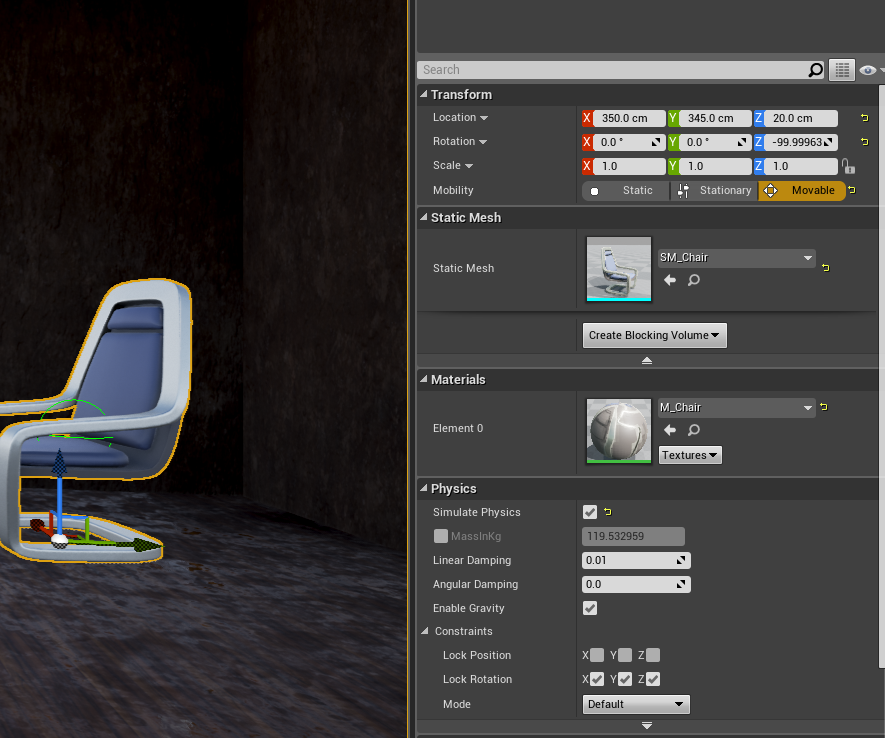

# Unreal Engine Course Exercises.

[The Unreal Engine Developer Course](https://www.udemy.com/unrealcourse/learn/v4/overview)

If you're a student of this couse trying to get through it on Mac OSX, this project might
help.  I'm having a lot of fun with it, and enjoying the fact that it uses C++ instead of
an over-reliance on BluePrints.  I think that BluePrints are great, but there are far too
many very complex BluePrints out there...'

Here's my review of the course:

Great course well, explained. Loads of resources, and very well organised. I'm finding the pace a bit slow personally, but that is probably because the course is really trying to target newbie programmers. Since its the only intro to Unreal that I have found that handles C++ its a great for me as a C++ veteran, and experienced native games programmer, from that perspective, but I'm having to try to skip forward without missing little bits and pieces that are unique to Unreal. If there was some kind of "Path for the more advanced programmer" that would be good. I did skip the whole of the "Learn C++" section 2 thing as advised and I've jumped into section 3, but from there its a bit hard to filter out the hand-holding part of it.
